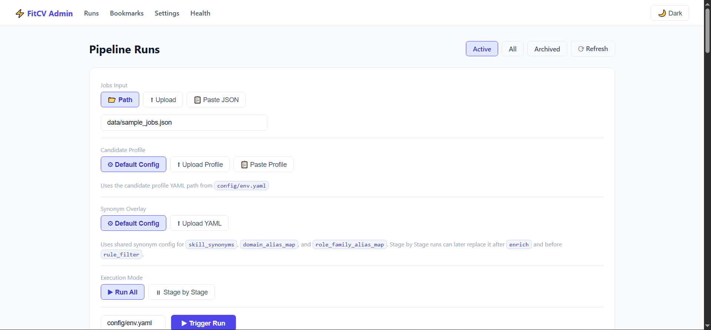
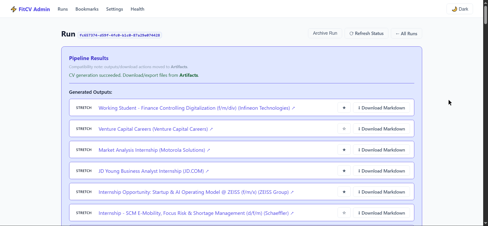
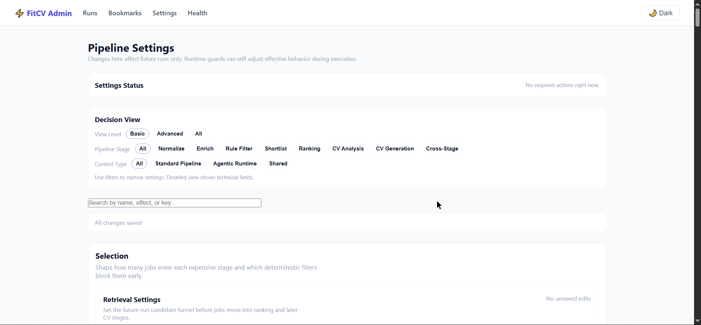
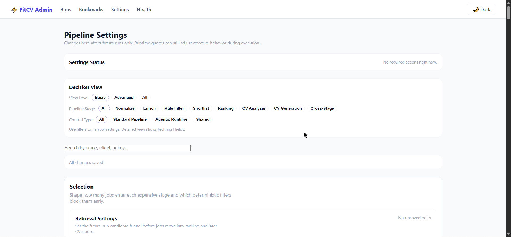

# FitCV

> Evidence-first job matching + CV generation, backed by operator control plane.

FitCV turns noisy job posts into a reviewable shortlist, then generates CV outputs
only when upstream evidence says “ready”. Everything stays inspectable through
run artifacts, stage-owned truth, and admin UI surfaces.

## Who Uses It

- **Operators** running application batches and reviewing outcomes in admin UI.
- **Engineers** maintaining pipeline logic, settings, and run infrastructure.
- **Workflow owners** needing repeatable, inspectable CV production with run-level evidence.

## What It Does

- Ingest many job posts
- Normalize + enrich to stable structured fields
- Filter weak candidates before expensive work
- Rank best jobs with explainable outcomes
- Analyze readiness + evidence
- Generate CV outputs with validation/repair safeguards
- Persist artifacts so operator can inspect what happened

## Job Data Input (LinkedIn via Apify)

Primary upstream source: scraped LinkedIn job posts produced by Apify actor
`bebity/linkedin-jobs-scraper`.

FitCV ingestion expects a JSON file containing a top-level array of job objects
(the actor’s output shape) and loads it via `jobs_path` when triggering a run.

Single source of truth: [docs/job-data-input.md](docs/job-data-input.md).

Stage order:

`normalize → enrich → rule_filter → shortlist → ranking → cv_analysis → cv_generation`

## Why It’s Different

- **Evidence-first pipeline**: stage outputs are stage-owned truth; UI shows derived views.
- **Operator control plane**: trigger runs, inspect stages/items, download artifacts, manage lifecycle.
- **Cost control by design**: narrowing happens in layers; late-stage work gated by readiness.
- **Portability**: sqlite and bigquery backends aim to preserve same operator-visible contracts.

## Key Pipeline Stages

1. **normalize** — canonicalize and deduplicate input jobs.
2. **enrich** — derive structured fields (skills, role, level, domain signals).
3. **rule_filter** — apply deterministic exclusion rules.
4. **shortlist** — retrieve plausible candidates for deeper scoring.
5. **ranking** — compute fit decisions and promote best jobs.
6. **cv_analysis** — gather grounded evidence and readiness signals.
7. **cv_generation** — generate CV output with validation/repair safeguards.

See deep stage behavior in [docs/FitCV-pipeline.md](docs/FitCV-pipeline.md) and [docs/pipeline.md](docs/pipeline.md).

## Stage Methods (How Each Stage Works)

- **normalize**
  - whitespace normalization + key canonicalization
  - exact dedupe by `job_url`
  - near-dedupe by `(company_id, title, sha256(description))` (keeps first, records exclusions)

- **enrich**
  - LLM structured extraction (prompt render + runtime model routing)
  - global request pacing (rate slot) to reduce provider throttling
  - sqlite cache for reused structured jobs (reuse status + contract fingerprint)

- **rule_filter**
  - deterministic gates before embeddings/LLM cost
  - config-driven signals (seniority, location/contract/experience excludes, must-have skills, domain prefs)
  - synonym canonicalization for skills (taxonomy-aware matching)

- **shortlist**
  - candidate+job embedding retrieval (`embeddings.py`)
  - vector shortlist with similarity scoring (cosine)
  - query embedding cache + contract fingerprint (reuse vs fresh)
  - top-N controls (`vector_search_top_n`, retrieval strategy)

- **ranking**
  - weighted ensemble over features: `ai_score`, `must_have_match`, `vector_similarity`, `title_relevance`, `seniority_fit`, `preference_fit`
  - configurable weights + safe missing-value defaults (validated contract)
  - taxonomy-aware neighbors (domain / role-family proximity)

- **cv_analysis**
  - fit gate from ranking (`strong/stretch/skip`) blocks weak jobs
  - evidence retrieval + selection: lexical + optional embedding similarity
  - quotas + trimming (top-k per evidence type, bullet/highlight limits)
  - gap analysis + requirement coverage summary (what missing, what supported)

- **cv_generation**
  - structured JSON generation via OpenAI-compatible API (`responses` preferred, fallback `chat/completions`)
  - template variants by `job_family`, section composition from config
  - validation: required sections present, placeholder detection, grounding/consistency checks
  - optional agentic late-stage mode (via `fitcv-langgraph`) when enabled via `FITCV_LANGGRAPH_*`

## Major Features and Engineering Highlights

- **Control-plane run operations**: trigger runs, inspect stages/items, stop/archive lifecycle actions.
- **Settings-driven execution**: persistent settings applied through control-plane settings store.
- **Artifact-backed observability**: run/item diagnostics and downloadable outputs.
- **Reuse/performance safeguards**: bounded reuse in selected stages to reduce redundant work.
- **Generation safety**: validation and deterministic repair path for low-risk output defects.
- **Bookmarks**: save jobs from run detail and review later at `/admin/bookmarks` (persists across runs).

Related docs:

- [docs/api.md](docs/api.md)
- [docs/architecture.md](docs/architecture.md)
- [docs/component_boundaries.md](docs/component_boundaries.md)
- [docs/configuration.md](docs/configuration.md)
- [docs/observability.md](docs/observability.md)

## Demo (Local)

After setup, open admin UI:

```text
http://localhost:8000/admin/runs
```

Bookmark flow:

- open run detail → Pipeline Results
- click star to save/remove
- review saved list at `http://localhost:8000/admin/bookmarks`

## Screenshots










## Architecture

```text
Inputs (file/path/json)
  -> FastAPI control plane (src/fitcv_cp)
  -> Redis + RQ worker execution
  -> Core pipeline stages (src/fitcv)
  -> Persistent run state + artifacts
  -> Admin inspection/download surfaces
```

Primary architecture references:

- [docs/architecture.md](docs/architecture.md)
- [docs/fitcv-control-plane-setup.md](docs/fitcv-control-plane-setup.md)
- [docs/pipeline.md](docs/pipeline.md)

## Tech Stack (Skills Shown)

- Python 3.11, FastAPI, Jinja2 templates
- Redis + RQ worker orchestration
- Config SSOT + compatibility bridging (`config/env.yaml`, `config/runtime/*`)
- SQLite + BigQuery backend adapters
- Test suite for config/contracts and control-plane behaviors

## Getting Started

### Pre-requisites

- Python environment (`.venv` expected in repo workflows)
- Docker + Docker Compose
- Redis (via compose service)
- Runtime config file (default: `config/env.yaml`; legacy `.env.yaml` is accepted only as local override)
- Credentials required by configured backends (see setup doc)

### Setup

- Read setup guide: [docs/fitcv-control-plane-setup.md](docs/fitcv-control-plane-setup.md)
- Start local services:

```powershell
docker compose up -d --build redis web worker
```

## Docs Index

| Topic | Doc |
|---|---|
| Setup / runbook | [docs/fitcv-control-plane-setup.md](docs/fitcv-control-plane-setup.md) |
| Setup (quick) | [docs/setup.md](docs/setup.md) |
| Usage | [docs/usage.md](docs/usage.md) |
| API | [docs/api.md](docs/api.md) |
| Architecture | [docs/architecture.md](docs/architecture.md) |
| Component boundaries | [docs/component_boundaries.md](docs/component_boundaries.md) |
| Configuration | [docs/configuration.md](docs/configuration.md) |
| Pipeline (contract-ish) | [docs/pipeline.md](docs/pipeline.md) |
| Pipeline (story) | [docs/FitCV-pipeline.md](docs/FitCV-pipeline.md) |
| Observability | [docs/observability.md](docs/observability.md) |
